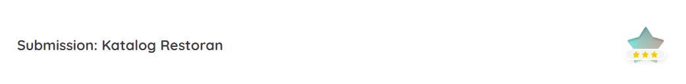
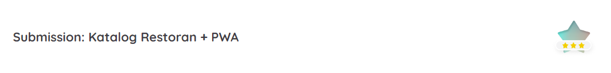
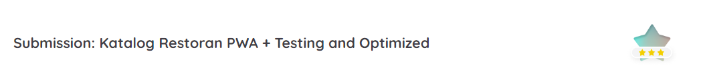

# Submission
```bash
# Perintah untuk menginstal semua paket yang diperlukan

npm run install
```

```bash
# Perintah untuk menjalankan project

npm start-dev
```

```bash
# Perintah untuk build project

npm run build
```

```bash
# Perintah untuk testing

npm run test
```

```bash
# Perintah untuk preview project

npm run serve
```

```bash
# Perintah untuk cek linter

npm run lint
```

```bash
# Perintah untuk end-to-end testing

npm run e2e
```

```bash
# Perintah untuk cek kompresi gambar

npm run build-image
```
## Submission: Katalog Restoran

### Fitur yang harus ada pada aplikasi: 

1. **App Bar (Navigation Bar)**
- Syarat:
    - Menampilkan nama aplikasi atau brand logo dari aplikasi katalog restoran (tentukan sendiri nama aplikasi atau brand logonya).
    - Terdapat navigation menu:
        - Home → mengarah ke root domain.
        - Favorite → target URL cukup bernilai “#” (Sebagai placeholder untuk digunakan pada submission selanjutnya).
        - About Us → arahkan ke profil LinkedIn/Github/Social Media Anda, atau boleh juga ke personal web/blog.
    - Terdapat fitur navigation drawer yang berfungsi dengan baik bila diakses pada layar seluler.

2. **Hero Element (Jumbotron Element)**
- Syarat:
   - Menampilkan hero element dengan gambar yang sudah ditentukan, silakan pilih salah satu aset yang disediakan di dalam starter proyek, src → public → images → hero. Gambar yang tidak digunakan, bisa Anda hapus.
   - Gambar hero element yang ditampilkan haruslah full-width atau memenuhi persyaratan sebagai berikut. 
        - Tampilkan minimal dengan width 1000px pada ukuran viewport width >= 1200px.
        - Jika ukuran viewport width < 1200px, hero element ditampilkan full-width.

3. **Daftar Restoran**
- Syarat:
    - Menampilkan daftar restoran berdasarkan data yang sudah disediakan di dalam project starter–lokasinya ada di src → public → data → DATA.json. Untuk menampilkannya dapat melalui cara hardcoded–dituliskan dalam HTML secara langsung–atau DOM manipulation menggunakan JavaScript.
    - Wajib menampilkan nama, gambar, dan minimal salah satu di antara kota, rating, dan/atau deskripsi pada restoran.

4. **Footer**
- Syarat:
    - Terdapat footer yang ditampilkan di bawah halaman.
    - Terdapat konten teks bebas sesuai dengan kreatifitas Anda. Misalnya, konten hak cipta yang mencangkup tahun dan nama aplikasi. Contoh: “Copyright © 2020 - Hunger Apps”.

5. **Responsibilitas Tampilan**
- Syarat:
    - Tampilan web app harus responsif pada seluruh ukuran layar (mobile - tablet - desktop). Utamakan tampilan mobile terlebih dahulu.
    - Gunakan teknik Grid CSS atau Flexbox dalam menyusun layout. Bila terdapat float, submission Anda akan kami ditolak.
    - Menetapkan ukuran viewport secara dinamis berdasarkan layar device yang digunakan.

6. **Aksesibilitas Website**
- Syarat:
    - Seluruh fungsionalitas website dapat dilakukan dengan menggunakan keyboard. Contohnya mengakses tombol hamburger button, mengakses tautan yang ada, dan lain sebagainya.
    - Menerapkan teknik Skip to Content untuk melewati focus pada menu navigasi.
    - Terdapat alternative teks pada seluruh gambar yang ditampilkan. Bila ada gambar yang tidak memiliki arti apa pun, cukup berikan atribut alt dengan nilai kosong. 
    - Dimensi touch target pada elemen yang diinteraksikan dengan touch harus memilliki ukuran elemen minimal 44x44px. Adapun beberapa contoh elemen tersebut meliputi button, anchor, input text, dan textarea.
    - Pastikan juga terdapat jarak antar elemen tersebut supaya dimensi touch target tidak menumpuk.
    - Menggunakan semantic element dalam menyusun struktur dan landmarking HTML.

### Submission Anda akan dinilai oleh reviewer dengan **skala 1-5** berdasarkan dari parameter yang ada.

Anda dapat menerapkan beberapa **saran** untuk mendapatkan nilai tinggi. Beberapa saran tersebut dapat dilihat pada poin-poin di bawah ini.

- Menerapkan tampilan aplikasi yang menarik. Berikut adalah beberapa checklist dari saran ini.
    - Memiliki pemilihan warna yang pas dengan tema aplikasi (Dalam memilih warna, Anda dapat memanfaatkan tools pemilihan warna seperti colorhunt.co).
    - Tata letak elemen yang pas.
Contoh: Tidak ada konten yang bertumpuk.
    - Penggunaan font yang pas dengan tema.
    - Penerapan padding, margin yang pas.
  
- Terdapat konten tambahan yang relevan dengan tema aplikasi atau di luar dari data yang disediakan.
Menggunakan elemen secara bijak sesuai dengan fungsinya. Contoh: tidak menggunakan button sebagai anchor ataupun sebaliknya.
Dalam penyusunan CSS, Anda boleh menggunakan CSS preprocessor seperti SASS bila nyaman menggunakannya. Gunakanlah sass-loader untuk memuat berkas sass pada webpack.

## Submission: Katalog Restoran + PWA

### Fitur yang harus ada pada aplikasi:
1. **Halaman Utama (Daftar Restoran)**
- Syarat:
    - Menampilkan daftar restoran yang datanya bersumber dari API: restaurant-api.dicoding.dev. Silakan lihat dokumentasinya pada halaman tersebut.
    - Wajib menampilkan nama, gambar, dan minimal salah satu di antara kota, rating, dan/atau deskripsi pada restoran.
    - Ada tautan/CTA yang mengarah ke detail restoran pada setiap item-nya.
    - Hero elemen tetap dipertahankan.

2. **Halaman Detail Restoran**
- Syarat:
    - Menampilkan detail dari restoran yang dipilih dari halaman utama (daftar restoran) atau halaman favorit restoran.
    - Pada halaman detail restoran harus berisi hal-hal berikut.
        - Nama restoran
        - Gambar
        - Alamat
        - Kota 
        - Deskripsi
        - Menu Makanan
        - Menu Minuman
        - Customer Reviews
    - Ada tombol favorite untuk memasukkan atau menghapus restoran favorit dari database. Penyimpanan ini menggunakan IndexedDB.

3. **Halaman Daftar Restoran Favorit**
- Syarat:
    - Halaman daftar restoran dapat diakses melalui menu navigasi favorit.
    - Menampilkan restoran yang difavoritkan oleh pengguna (data diambil dari indexedDB).
    - Wajib menampilkan nama, gambar dan minimal salah satu diantara kota, rating, dan atau deskripsi pada restoran.
    - Ada tautan/CTA yang mengarah ke detail restoran pada tiap itemnya.

4. **Native Capability**
- Syarat:
    - Aplikasi dapat diakses dalam keadaan offline tanpa ada aset yang gagal dimuat, termasuk data yang didapatkan dari API. Anda bebas menggunakan strategi caching apa pun, bahkan menggunakan workbox.
    - Aplikasi harus menampilkan icon Add to Home Screen.
    - Aplikasi memiliki custom icon yang ditampilkan pada home screen dan splash screen.

5. **Code Quality**
- Syarat:
    - Menggunakan ESLint sebagai linter ketika menuliskan kode JavaScript. **Harap lampirkan berkas konfigurasi ESLint**, ya.
    - Menerapkan salah satu style guide, baik Google JavaScript Code Style, AirBnB JavaScript Code Style, atau StandardJS Code Style.
    - Periksa kembali sebelum mengirimkan submission project Anda. Penuhi seluruh kriteria yang ditetapkan dalam konfigurasi linter Anda. Kondisi terpenuhinya kriteria ditandai dengan tidak adanya satupun error ketika menjalankan eslint.

6. **Pertahankan syarat yang ada pada submission sebelumnya**. Di antaranya, responsibilitas tampilan, aksesibilitas pada website, appbar, footer, dan sebagainya.

### Submission Anda akan dinilai oleh reviewer dengan skala 1-5 berdasarkan dari parameter yang akan kami sebutkan. Anda dapat menerapkan beberapa saran di bawah ini untuk mendapatkan nilai tinggi.

- Menambahkan fitur untuk memberikan customer review pada halaman detail. Silakan simak caranya pada dokumentasi API (Gunakan testing key untuk api key-nya).
- Alangkah baiknya bila Anda menerapkan Web Component secara native menggunakan Custom Element.
- Mengimplementasikan indikator loading saat data sedang dimuat dari server dan tampilkan keterangan/umpan balik bila hasil request HTTP yang dilakukan terjadi kegagalan.

## Submission: Katalog Restoran PWA + Testing and Optimized

### Fitur yang harus ada pada aplikasi:

1. **Integration Test**
- Syarat:
    - Menerapkan integration test untuk fungsi menyukai dan batal menyukai restoran.

2. **End to End Test**
- Syarat:
    - Menerapkan End to End Test dengan skenario:
        - Menyukai salah satu restoran.
        - Batal menyukai restoran tersebut.

3. **Image Optimization**
- Syarat:
    - Melakukan kompresi terhadap gambar hero yang digunakan. Ukuran gambar harus di bawah 200kb.
    - Menerapkan teknik image responsive pada gambar hero. Resolusi gambar pada layar seluler dan desktop harus berbeda.
    - Menerapkan teknik lazy loading pada gambar daftar restoran yang ditampilkan.

4. **Bundle Optimization**
- Syarat:
    - Memasang bundle analyzer pada proyek submission.
    - Gunakan teknik Code Splitting untuk memisahkan vendor code dari kode asli yang Anda tuliskan.
5. **Pertahankan syarat yang ada pada submission sebelumnya**. Seperti penerapan PWA, responsibilitas tampilan,  aksesibilitas pada website dan sebagainya.

### Submission Anda akan dinilai oleh reviewer dengan **skala 1-5** berdasarkan dari parameter yang ada.

Anda dapat menerapkan beberapa **saran** di bawah ini untuk mendapatkan nilai tinggi, berikut sarannya:

- Menuliskan test case secara lengkap, mulai dari kasus positif hingga kasus negatif. Pastikan test case yang dijalankan berhasil.
- Menerapkan End to End test pada skenario lain di luar yang sudah ditentukan. Pastikan test case yang dijalankan berhasil.
Contoh: bila aplikasi terdapat fitur customer review, lakukan End to End test pada fitur tersebut.
- Menerapkan optimasi lain di luar dari optimasi yang menjadi persyaratan. Contoh, Anda bisa menerapkan pendekatan skeleton UI, minify/uglify CSS.
- Mendeploy hasil web app yang Anda kerjakan ke third-party hosting. Seperti Firebase Hosting, Netlify, Heroku, Github Pages, atau yang lainnya. Serta, memperhatikan metrik Web Vitals dengan nilai:
**FCP** < 2.5 detik
**FID/TBT** < 100 ms
**CLS** < 0.1
Note: Lampirkan URL dari laman web yang sudah di hosting pada Student Notes.  